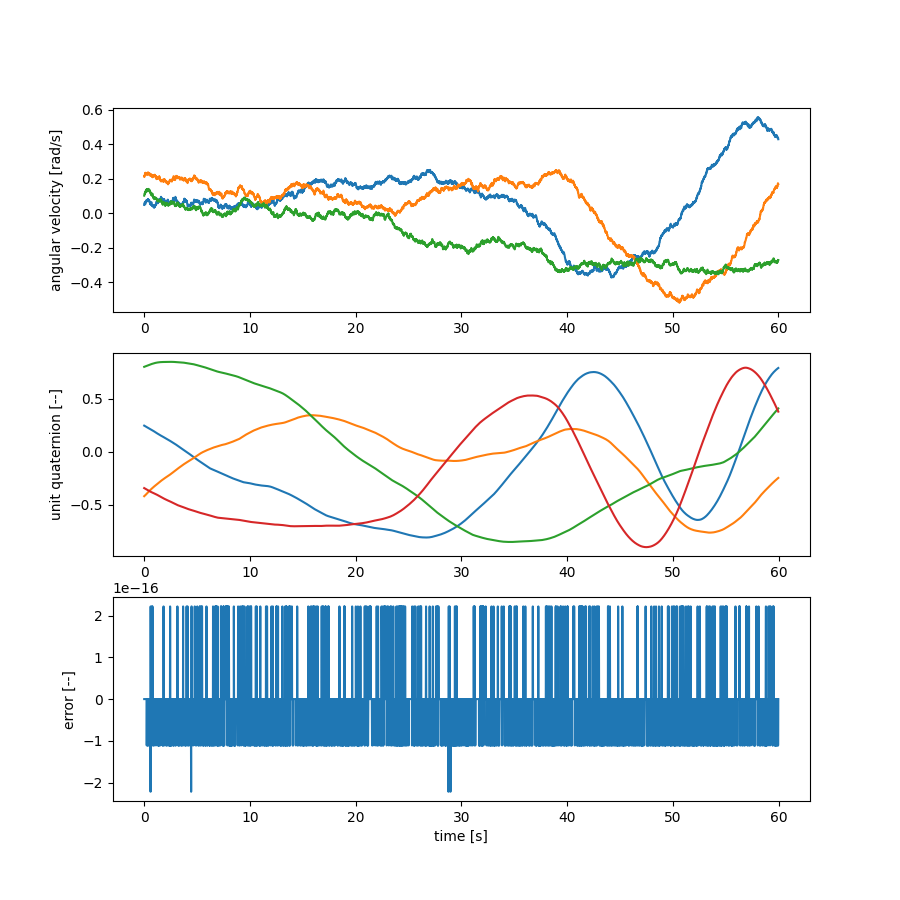

Attitude Dynamics
=================

Partial derivatives
-------------------

The attitude model provies partial derivatives that OpenMDAO can use for
gradient-based optimization.
The following script checks the accuracy of the partial derivatives for
the attitude module.

.. code-block:: python

  from openmdao.api import Problem, Group
  from openmdao.api import IndepVarComp
  from lsdo_cubesat.utils.random_arrays import make_random_bounded_array
  import matplotlib.pyplot as plt
  from lsdo_cubesat.attitude.new.attitude_rk4_gravity_comp import AttitudeRK4GravityComp
  import numpy as np
  
  np.random.seed(0)
  num_times = 100
  step_size = 1e-7
  I = np.array([90, 100, 80])
  wq0 = np.random.rand(7) - 0.5
  wq0[3:] /= np.linalg.norm(wq0[3:])
  
  comp = IndepVarComp()
  comp.add_output('initial_angular_velocity_orientation', val=wq0)
  comp.add_output(
      'external_torques_x',
      val=make_random_bounded_array(num_times, bound=1).reshape((1, num_times)),
      shape=(1, num_times),
  )
  comp.add_output(
      'external_torques_y',
      val=make_random_bounded_array(num_times, bound=1).reshape((1, num_times)),
      shape=(1, num_times),
  )
  comp.add_output(
      'external_torques_z',
      val=make_random_bounded_array(num_times, bound=1).reshape((1, num_times)),
      shape=(1, num_times),
  )
  prob = Problem()
  prob.model.add_subsystem('inputs_comp', comp, promotes=['*'])
  prob.model.add_subsystem(
      'comp',
      AttitudeRK4GravityComp(
          num_times=num_times,
          step_size=step_size,
          moment_inertia_ratios=np.array([2.0 / 3.0, -2.0 / 3.0, 0]),
      ),
      promotes=['*'],
  )
  
  prob.setup(check=True, force_alloc_complex=True)
  prob.check_partials(compact_print=True)
  
::

  INFO: checking out_of_order
  INFO: checking system
  INFO: checking solvers
  INFO: checking dup_inputs
  INFO: checking missing_recorders
  WARNING: The Problem has no recorder of any kind attached
  INFO: checking comp_has_no_outputs
  ----------------------------------------
  Component: AttitudeRK4GravityComp 'comp'
  ----------------------------------------
  '<output>'                     wrt '<variable>'                           | fwd mag.   | rev mag.   | check mag. | a(fwd-chk) | a(rev-chk) | a(fwd-rev) | r(fwd-chk) | r(rev-chk) | r(fwd-rev)
  ----------------------------------------------------------------------------------------------------------------------------------------------------------------------------------------------
  
  'angular_velocity_orientation' wrt 'external_torques_x'                   | 7.0356e-06 | 7.0356e-06 | 7.0357e-06 | 4.8787e-09 | 4.8787e-09 | 0.0000e+00 | 6.9342e-04 | 6.9342e-04 | 0.0000e+00 >REL_TOL
  'angular_velocity_orientation' wrt 'external_torques_y'                   | 7.0356e-06 | 7.0356e-06 | 7.0349e-06 | 5.0251e-09 | 5.0251e-09 | 0.0000e+00 | 7.1430e-04 | 7.1430e-04 | 0.0000e+00 >REL_TOL
  'angular_velocity_orientation' wrt 'external_torques_z'                   | 7.0356e-06 | 7.0356e-06 | 7.0354e-06 | 5.0812e-09 | 5.0812e-09 | 0.0000e+00 | 7.2223e-04 | 7.2223e-04 | 0.0000e+00 >REL_TOL
  'angular_velocity_orientation' wrt 'initial_angular_velocity_orientation' | 2.6458e+01 | 2.6458e+01 | 2.4495e+01 | 1.0000e+01 | 1.0000e+01 | 3.4825e-17 | 4.0825e-01 | 4.0825e-01 | 1.4217e-18 >ABS_TOL >REL_TOL
  'angular_velocity_orientation' wrt 'osculating_orbit_angular_speed'       | 1.5482e-08 | 1.5482e-08 | 1.6697e-08 | 5.9073e-09 | 5.9073e-09 | 0.0000e+00 | 3.5379e-01 | 3.5379e-01 | 0.0000e+00 >REL_TOL
  
  #######################################################################
  Sub Jacobian with Largest Relative Error: AttitudeRK4GravityComp 'comp'
  #######################################################################
  '<output>'                     wrt '<variable>'                           | fwd mag.   | rev mag.   | check mag. | a(fwd-chk) | a(rev-chk) | a(fwd-rev) | r(fwd-chk) | r(rev-chk) | r(fwd-rev)
  ----------------------------------------------------------------------------------------------------------------------------------------------------------------------------------------------
  'angular_velocity_orientation' wrt 'initial_angular_velocity_orientation' | 2.6458e+01 | 2.6458e+01 | 2.4495e+01 | 1.0000e+01 | 1.0000e+01 | 3.4825e-17 | 4.0825e-01 | 4.0825e-01 | 1.4217e-18
  

Time history of attitude dynamics
---------------------------------

.. code-block:: python

  from openmdao.api import Problem, Group
  from openmdao.api import IndepVarComp
  from lsdo_cubesat.utils.random_arrays import make_random_bounded_array
  import matplotlib.pyplot as plt
  from lsdo_cubesat.attitude.new.attitude_rk4_gravity_comp import AttitudeRK4GravityComp
  import numpy as np
  
  np.random.seed(0)
  num_times = 6000
  step_size = 1e-2
  I = np.array([90, 100, 80])
  wq0 = np.array([-1, 0.2, 0.3, 0, 0, 0, 1])
  
  wq0 = np.random.rand(7) - 0.5
  wq0[3:] /= np.linalg.norm(wq0[3:])
  
  comp = IndepVarComp()
  comp.add_output('initial_angular_velocity_orientation', val=wq0)
  comp.add_output(
      'external_torques_x',
      val=make_random_bounded_array(num_times, bound=1).reshape((1, num_times)),
      shape=(1, num_times),
  )
  comp.add_output(
      'external_torques_y',
      val=make_random_bounded_array(num_times, bound=1).reshape((1, num_times)),
      shape=(1, num_times),
  )
  comp.add_output(
      'external_torques_z',
      val=make_random_bounded_array(num_times, bound=1).reshape((1, num_times)),
      shape=(1, num_times),
  )
  
  prob = Problem()
  prob.model.add_subsystem('inputs_comp', comp, promotes=['*'])
  prob.model.add_subsystem(
      'comp',
      AttitudeRK4GravityComp(
          num_times=num_times,
          step_size=step_size,
          moment_inertia_ratios=np.array([2.0 / 3.0, -2.0 / 3.0, 0]),
      ),
      promotes=['*'],
  )
  
  prob.setup(check=True, force_alloc_complex=True)
  prob.run_model()
  w = prob['angular_velocity_orientation'][:3, :]
  q = prob['angular_velocity_orientation'][3:, :]
  
  fig, ax = plt.subplots(3, 1)
  t = np.arange(num_times) * step_size
  
  ax[0].plot(t, w[0, :])
  ax[0].plot(t, w[1, :])
  ax[0].plot(t, w[2, :])
  
  ax[1].plot(t[:-1], q[0, :-1])
  ax[1].plot(t[:-1], q[1, :-1])
  ax[1].plot(t[:-1], q[2, :-1])
  ax[1].plot(t[:-1], q[3, :-1])
  
  ax[2].plot(t[:-1], np.linalg.norm(q[:, :-1], axis=0) - 1)
  ax[2].set_xlabel('time [s]')
  ax[0].set_ylabel('angular velocity [rad/s]')
  ax[1].set_ylabel('unit quaternion [--]')
  ax[2].set_ylabel('error [--]')
  fig = plt.gcf()
  fig.set_size_inches(9, 9)
  plt.show()
  

