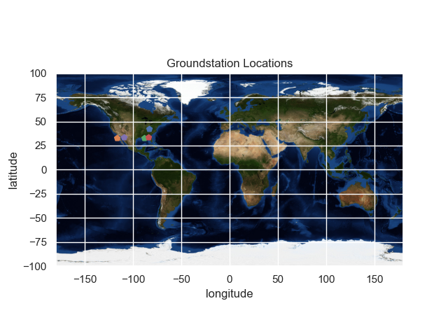

Groundstations
==============

This example shows the locations of some groundstations on a map of the Earth.

.. code-block:: python

  import matplotlib.pyplot as plt
  import matplotlib.image as mpimg
  import numpy as np
  import pyproj
  import pickle
  import pandas as pd
  import seaborn as sns

  from PIL import Image

  ecef = pyproj.Proj(proj='geocent', ellps='WGS84', datum='WGS84')
  lla = pyproj.Proj(proj='latlong', ellps='WGS84', datum='WGS84')

  grid = plt.GridSpec(2, 4, wspace=0.5, hspace=0.5)
  plt.subplot(grid[0, 0])
  plt.subplot(grid[0, 1:3])
  plt.subplot(grid[0, 3])
  plt.subplot(grid[1, 0])
  plt.subplot(grid[1, 1:3])
  plt.subplot(grid[1, 3])
  plt.show()

  path = "/home/packages/lsdo_cubesat/lsdo_cubesat/map/world.jpg"
  earth = mpimg.imread(path)

  img = Image.open(path)
  fig, ax = plt.subplots()
  sns.set()
  ax.imshow(earth, extent=[-180, 180, -100, 100])
  ax.scatter(-83.7264, 42.2708, marker="p", label="Michigan")
  ax.scatter(-117.2340, 32.8801, marker="p", label="UCSD")
  ax.scatter(-88.2272, 40.1020, marker="p", label="UIUC")
  ax.scatter(-84.3963, 33.7756, marker="p", label="Georgia")
  ax.scatter(-109.533691, 46.9653, marker="p", label="Montana")
  plt.xlabel("longitude")
  plt.ylabel("latitude")
  plt.title("Groundstation Locations")
  plt.show()

