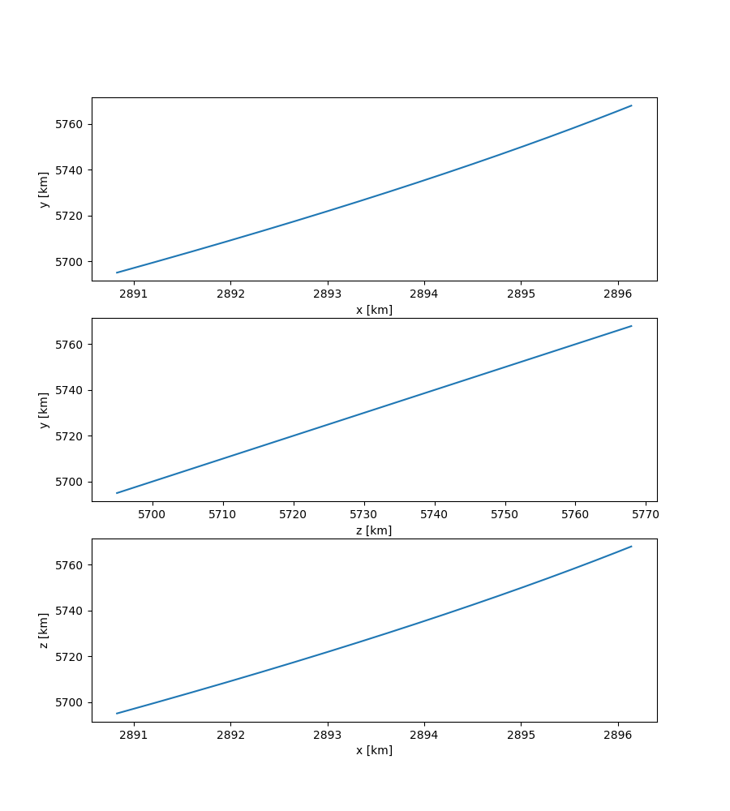

Reference Orbit
================

Reference Orbit for a Spacecraft with Thusters Turned Off
---------------------------------------------------------

.. code-block:: python

  from openmdao.api import ExplicitComponent, Problem, Group, IndepVarComp
  import numpy as np
  import matplotlib.pyplot as plt
  from lsdo_cubesat.orbit.reference_orbit_rk4_comp import ReferenceOrbitRK4Comp
  from lsdo_cubesat.orbit.reference_orbit_group import ReferenceOrbitGroup
  from lsdo_cubesat.orbit.initial_orbit_comp import InitialOrbitComp
  from lsdo_cubesat.orbit.orbit_state_decomposition_comp import OrbitStateDecompositionComp
  from lsdo_cubesat.swarm.cubesat import Cubesat
  import seaborn as sns
  
  np.random.seed(0)
  
  num_times = 25000
  step_size = 1e-3
  
  prob = Problem()
  
  cubesat = Cubesat()
  comp = IndepVarComp()
  comp.add_output('radius_earth_km',
                  val=cubesat['radius_earth_km'],
                  shape=num_times)
  for var_name in [
          'perigee_altitude',
          'apogee_altitude',
          'RAAN',
          'inclination',
          'argument_of_periapsis',
          'true_anomaly',
  ]:
      comp.add_output(var_name, val=cubesat[var_name])
  prob.model.add_subsystem('input_comp', comp, promotes=['*'])
  
  comp = InitialOrbitComp()
  prob.model.add_subsystem('initial_orbit_comp', comp, promotes=['*'])
  
  comp = ReferenceOrbitRK4Comp(
      num_times=num_times,
      step_size=step_size,
  )
  prob.model.add_subsystem('orbit_rk4_comp', comp, promotes=['*'])
  
  comp = OrbitStateDecompositionComp(
      num_times=num_times,
      position_name='position_km',
      velocity_name='velocity_km_s',
      orbit_state_name='reference_orbit_state_km',
  )
  prob.model.add_subsystem(
      'orbit_state_decomposition_comp',
      comp,
      promotes=['*'],
  )
  prob.setup()
  prob.run_model()
  
  fig, ax = plt.subplots(3, 1, figsize=(9, 10))
  x = prob['reference_orbit_state_km'][0, :]
  y = prob['reference_orbit_state_km'][1, :]
  z = prob['reference_orbit_state_km'][1, :]
  sns.lineplot(x=x, y=y, ax=ax[0])
  sns.lineplot(x=z, y=y, ax=ax[1])
  sns.lineplot(x=x, y=z, ax=ax[2])
  
  ax[0].set_xlabel('x [km]')
  ax[1].set_xlabel('z [km]')
  ax[2].set_xlabel('x [km]')
  ax[0].set_ylabel('y [km]')
  ax[1].set_ylabel('y [km]')
  ax[2].set_ylabel('z [km]')
  plt.show()
  

